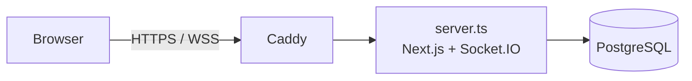
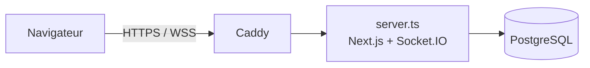

# taype-in

[English](#english) · [Français](#français)

## English

Real-time multiplayer typing race game.

Live: https://laniproject.dev

> Fan project inspired by Rocket League. Not affiliated with or endorsed by Epic Games or Psyonix.

### Local setup

#### Requirements

- [Bun](https://bun.sh) 1.4 (package manager)
- [Node.js](https://nodejs.org) 24 (runs `server.ts` and the migrations without compiling)
- [Docker](https://www.docker.com) (PostgreSQL database)

#### Start

```bash
bun install
cp .env.example .env        # then adjust the values (PASSWORD_PEPPER: openssl rand -hex 32)
docker compose up -d        # PostgreSQL 17 on port POSTGRES_PORT
bun run db:migrate          # applies the migrations
bun run dev                 # http://localhost:3000
```

#### Commands

| Command               | Purpose                                                  |
| --------------------- | -------------------------------------------------------- |
| `bun run dev`         | Development server (Next.js + Socket.IO)                 |
| `bun run build`       | Production build                                         |
| `bun run start`       | Production server (after `build`)                        |
| `bun run lint`        | ESLint                                                   |
| `bun run test`        | Unit and integration tests (Vitest, database required)   |
| `bun run test:e2e`    | End-to-end tests (Playwright, starts `dev`)              |
| `bun run test:load`   | Load test: 300 participants in one race                  |
| `bun run db:generate` | Generates a migration after a schema change              |
| `bun run db:migrate`  | Applies the migrations                                   |

The first time, install the Playwright browser: `bunx playwright install chromium`.

### Architecture



- **Next.js** (App Router): pages, React components and server actions (authentication, creating and joining races).
- **Socket.IO**: real time for lobbies and races. It shares the same HTTP server and port as Next.js through the custom server [`server.ts`](server.ts). Choice explained in [ADR 0001](docs/adr/0001-realtime.md).
- **PostgreSQL** with **Drizzle ORM**: accounts, sessions, texts, lobbies, races and results.
- **Caddy** (production): reverse proxy and automatic HTTPS certificate.

#### Structure

| Folder        | Contents                                                                 |
| ------------- | ------------------------------------------------------------------------ |
| `app/`        | Next.js pages and server actions                                         |
| `components/` | React components                                                         |
| `lib/`        | Business logic: authentication, races, state machines, Socket.IO server |
| `db/`         | Drizzle schema, connection, migrations                                   |
| `i18n/`, `messages/` | French / English translations (next-intl)                         |
| `__tests__/`  | Vitest tests                                                             |
| `e2e/`        | Playwright tests                                                         |
| `docs/`       | Project documentation                                                    |

#### Documentation (in French)

- [Specification v1.1](docs/cahier-des-charges.pdf) ([docx](docs/cahier-des-charges.docx))
- [Data model](docs/modele-de-donnees.md)
- [State machines](docs/machines-a-etats.md)
- [ADR 0001: real time](docs/adr/0001-realtime.md)
- [Requirements matrix](docs/requirements-matrix.md)

#### Load test

`bun run test:load` checks that a race holds 300 participants (LOB-6). The script [`scripts/load-test.ts`](scripts/load-test.ts) starts its own Socket.IO server with the local database, creates 300 temporary users, has them join the same lobby, then type one keystroke every 200 ms for 10 s (about 60 words per minute). For each keystroke, it measures the delay until every client receives it in `race:positions`. It fails (exit code 1) if the 95th percentile exceeds 500 ms (positions are sent every 250 ms, plus a margin). The users and the lobby are deleted at the end. Another participant count can be passed: `bun run test:load 50`.

Result from October 2, 2026 (MacBook, server and 300 clients in the same Node process):

| Participants | `race:positions` received | Keystrokes measured | p50    | p95    | Max    |
| ------------ | ------------------------- | ------------------- | ------ | ------ | ------ |
| 300          | 12,600                    | 4,500,000           | 142 ms | 250 ms | 300 ms |

The delay comes mostly from the 250 ms interval between two position broadcasts.

#### Continuous integration

Every PR runs [GitHub Actions](.github/workflows/ci.yml): lint, type check, migrations, Vitest tests, build and Docker image build.

### Deployment

The application runs on an AWS EC2 instance (Ubuntu) with Docker Compose. [`compose.prod.yml`](compose.prod.yml) starts three services:

- `app`: image built by the [`Dockerfile`](Dockerfile). On startup, the container applies the migrations (`node db/migrate.ts`) then runs `server.ts`.
- `postgres`: database, not exposed outside Docker.
- `caddy`: serves the `DOMAIN` domain over HTTPS (ports 80 and 443) according to the [`Caddyfile`](Caddyfile).

#### First server setup

1. Create the EC2 instance with an Elastic IP. Security group: ports 80 and 443 open, port 22 limited to your IP.
2. Point the domain's DNS (A record) to the Elastic IP.
3. On the server, install Docker and add a 2 GB swap file (the Next.js build runs out of memory without it).
4. Clone the repository into `~/taype-in`, then create `.env` from `.env.example`:
   - `POSTGRES_PASSWORD` without special characters (`openssl rand -hex 24`), since it is inserted as is into `DATABASE_URL`;
   - `PASSWORD_PEPPER` generated with `openssl rand -hex 32`, **back it up elsewhere**: losing it invalidates every password;
   - `DOMAIN`: the domain to serve.
5. Start:

   ```bash
   docker compose -f compose.prod.yml up -d --build
   ```

Caddy gets the HTTPS certificate on first start.

#### Updating

```bash
ssh -i <key.pem> ubuntu@laniproject.dev
cd ~/taype-in
git pull
docker compose -f compose.prod.yml up -d --build
```

The image is rebuilt on the server; new migrations are applied when the `app` container restarts.

To read the logs: `docker compose -f compose.prod.yml logs -f app`.

## Français

Jeu de course de dactylographie multijoueur en temps réel.

En ligne : https://laniproject.dev

> Projet de fan inspiré de Rocket League. Non affilié à Epic Games ni à Psyonix, ni approuvé par eux.

### Installation locale

#### Prérequis

- [Bun](https://bun.sh) 1.4 (gestionnaire de paquets)
- [Node.js](https://nodejs.org) 24 (exécute `server.ts` et les migrations sans compilation)
- [Docker](https://www.docker.com) (base de données PostgreSQL)

#### Démarrer

```bash
bun install
cp .env.example .env        # puis ajuster les valeurs (PASSWORD_PEPPER : openssl rand -hex 32)
docker compose up -d        # PostgreSQL 17 sur le port POSTGRES_PORT
bun run db:migrate          # applique les migrations
bun run dev                 # http://localhost:3000
```

#### Commandes

| Commande              | Rôle                                                    |
| --------------------- | ------------------------------------------------------- |
| `bun run dev`         | Serveur de développement (Next.js + Socket.IO)          |
| `bun run build`       | Build de production                                     |
| `bun run start`       | Serveur de production (après `build`)                   |
| `bun run lint`        | ESLint                                                  |
| `bun run test`        | Tests unitaires et d'intégration (Vitest, base requise) |
| `bun run test:e2e`    | Tests de bout en bout (Playwright, lance `dev`)         |
| `bun run test:load`   | Test de charge : 300 participants dans une course       |
| `bun run db:generate` | Génère une migration après un changement du schéma     |
| `bun run db:migrate`  | Applique les migrations                                 |

La première fois, installer le navigateur de Playwright : `bunx playwright install chromium`.

### Architecture



- **Next.js** (App Router) : pages, composants React et actions serveur (authentification, création et accès aux courses).
- **Socket.IO** : temps réel des salles d'attente et des courses. Il partage le même serveur HTTP et le même port que Next.js grâce au serveur personnalisé [`server.ts`](server.ts). Choix expliqué dans l'[ADR 0001](docs/adr/0001-realtime.md).
- **PostgreSQL** avec **Drizzle ORM** : comptes, sessions, textes, salles, courses et résultats.
- **Caddy** (production) : reverse proxy et certificat HTTPS automatique.

#### Structure

| Dossier       | Contenu                                                                          |
| ------------- | -------------------------------------------------------------------------------- |
| `app/`        | Pages et actions serveur Next.js                                                 |
| `components/` | Composants React                                                                 |
| `lib/`        | Logique métier : authentification, courses, machines à états, serveur Socket.IO |
| `db/`         | Schéma Drizzle, connexion, migrations                                            |
| `i18n/`, `messages/` | Traductions français / anglais (next-intl)                                |
| `__tests__/`  | Tests Vitest                                                                     |
| `e2e/`        | Tests Playwright                                                                 |
| `docs/`       | Documentation du projet                                                          |

#### Documentation

- [Cahier des charges v1.1](docs/cahier-des-charges.pdf) ([docx](docs/cahier-des-charges.docx))
- [Modèle de données](docs/modele-de-donnees.md)
- [Machines à états](docs/machines-a-etats.md)
- [ADR 0001 : temps réel](docs/adr/0001-realtime.md)
- [Matrice des exigences](docs/requirements-matrix.md)

#### Test de charge

`bun run test:load` vérifie qu'une course tient 300 participants (LOB-6). Le script [`scripts/load-test.ts`](scripts/load-test.ts) lance son propre serveur Socket.IO avec la base locale, crée 300 utilisateurs temporaires, les fait rejoindre un même lobby puis taper une frappe toutes les 200 ms pendant 10 s (environ 60 mots par minute). Pour chaque frappe, il mesure le délai jusqu'à ce que chaque client la reçoive dans `race:positions`. Il échoue (code 1) si le 95e centile dépasse 500 ms (positions envoyées toutes les 250 ms, plus une marge). Les utilisateurs et le lobby sont supprimés à la fin. On peut passer un autre nombre de participants : `bun run test:load 50`.

Résultat du 2 octobre 2026 (MacBook, serveur et 300 clients dans le même processus Node) :

| Participants | `race:positions` reçus | Frappes mesurées | p50    | p95    | Max    |
| ------------ | ---------------------- | ---------------- | ------ | ------ | ------ |
| 300          | 12 600                 | 4 500 000        | 142 ms | 250 ms | 300 ms |

Le délai vient surtout de l'intervalle de 250 ms entre deux envois de positions.

#### Intégration continue

Chaque PR lance [GitHub Actions](.github/workflows/ci.yml) : lint, vérification des types, migrations, tests Vitest, build et build de l'image Docker.

### Déploiement

L'application tourne sur une instance AWS EC2 (Ubuntu) avec Docker Compose. [`compose.prod.yml`](compose.prod.yml) lance trois services :

- `app` : image construite par le [`Dockerfile`](Dockerfile). Au démarrage, le conteneur applique les migrations (`node db/migrate.ts`) puis lance `server.ts`.
- `postgres` : base de données, non exposée hors de Docker.
- `caddy` : sert le domaine `DOMAIN` en HTTPS (ports 80 et 443) selon le [`Caddyfile`](Caddyfile).

#### Première installation du serveur

1. Créer l'instance EC2 avec une IP élastique. Groupe de sécurité : ports 80 et 443 ouverts, port 22 limité à son IP.
2. Pointer le DNS du domaine (enregistrement A) vers l'IP élastique.
3. Sur le serveur, installer Docker et ajouter un fichier d'échange de 2 Go (le build de Next.js manque de mémoire sans lui).
4. Cloner le dépôt dans `~/taype-in`, puis créer le `.env` à partir de `.env.example` :
   - `POSTGRES_PASSWORD` sans caractères spéciaux (`openssl rand -hex 24`), car il est inséré tel quel dans `DATABASE_URL`;
   - `PASSWORD_PEPPER` généré avec `openssl rand -hex 32`, **à sauvegarder ailleurs** : le perdre invalide tous les mots de passe;
   - `DOMAIN` : le domaine servi.
5. Lancer :

   ```bash
   docker compose -f compose.prod.yml up -d --build
   ```

Caddy obtient le certificat HTTPS au premier démarrage.

#### Mettre à jour

```bash
ssh -i <clé.pem> ubuntu@laniproject.dev
cd ~/taype-in
git pull
docker compose -f compose.prod.yml up -d --build
```

L'image est reconstruite sur le serveur; les nouvelles migrations s'appliquent au redémarrage du conteneur `app`.

Pour lire les journaux : `docker compose -f compose.prod.yml logs -f app`.
