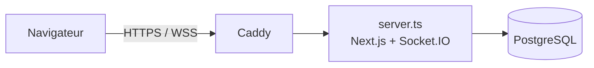

# taype-in

Jeu de course de dactylographie multijoueur en temps réel.

En ligne : https://laniproject.dev

> Projet de fan inspiré de Rocket League. Non affilié à Epic Games ni à Psyonix, ni approuvé par eux.

## Installation locale

### Prérequis

- [Bun](https://bun.sh) 1.4 (gestionnaire de paquets)
- [Node.js](https://nodejs.org) 24 (exécute `server.ts` et les migrations sans compilation)
- [Docker](https://www.docker.com) (base de données PostgreSQL)

### Démarrer

```bash
bun install
cp .env.example .env        # puis ajuster les valeurs (PASSWORD_PEPPER : openssl rand -hex 32)
docker compose up -d        # PostgreSQL 17 sur le port POSTGRES_PORT
bun run db:migrate          # applique les migrations
bun run dev                 # http://localhost:3000
```

### Commandes

| Commande              | Rôle                                                    |
| --------------------- | ------------------------------------------------------- |
| `bun run dev`         | Serveur de développement (Next.js + Socket.IO)          |
| `bun run build`       | Build de production                                     |
| `bun run start`       | Serveur de production (après `build`)                   |
| `bun run lint`        | ESLint                                                  |
| `bun run test`        | Tests unitaires et d'intégration (Vitest, base requise) |
| `bun run test:e2e`    | Tests de bout en bout (Playwright, lance `dev`)         |
| `bun run db:generate` | Génère une migration après un changement du schéma     |
| `bun run db:migrate`  | Applique les migrations                                 |

La première fois, installer le navigateur de Playwright : `bunx playwright install chromium`.

## Architecture



- **Next.js** (App Router) : pages, composants React et actions serveur (authentification, création et accès aux courses).
- **Socket.IO** : temps réel des salles d'attente et des courses. Il partage le même serveur HTTP et le même port que Next.js grâce au serveur personnalisé [`server.ts`](server.ts). Choix expliqué dans l'[ADR 0001](docs/adr/0001-realtime.md).
- **PostgreSQL** avec **Drizzle ORM** : comptes, sessions, textes, salles, courses et résultats.
- **Caddy** (production) : reverse proxy et certificat HTTPS automatique.

### Structure

| Dossier       | Contenu                                                                          |
| ------------- | -------------------------------------------------------------------------------- |
| `app/`        | Pages et actions serveur Next.js                                                 |
| `components/` | Composants React                                                                 |
| `lib/`        | Logique métier : authentification, courses, machines à états, serveur Socket.IO |
| `db/`         | Schéma Drizzle, connexion, migrations                                            |
| `i18n/`, `messages/` | Traductions français / anglais (next-intl)                                |
| `__tests__/`  | Tests Vitest                                                                     |
| `e2e/`        | Tests Playwright                                                                 |
| `docs/`       | Documentation du projet                                                          |

### Documentation

- [Modèle de données](docs/modele-de-donnees.md)
- [Machines à états](docs/machines-a-etats.md)
- [ADR 0001 : temps réel](docs/adr/0001-realtime.md)
- [Matrice des exigences](docs/requirements-matrix.md)

### Intégration continue

Chaque PR lance [GitHub Actions](.github/workflows/ci.yml) : lint, vérification des types, migrations, tests Vitest, build et build de l'image Docker.

## Déploiement

L'application tourne sur une instance AWS EC2 (Ubuntu) avec Docker Compose. [`compose.prod.yml`](compose.prod.yml) lance trois services :

- `app` : image construite par le [`Dockerfile`](Dockerfile). Au démarrage, le conteneur applique les migrations (`node db/migrate.ts`) puis lance `server.ts`.
- `postgres` : base de données, non exposée hors de Docker.
- `caddy` : sert le domaine `DOMAIN` en HTTPS (ports 80 et 443) selon le [`Caddyfile`](Caddyfile).

### Première installation du serveur

1. Créer l'instance EC2 avec une IP élastique. Groupe de sécurité : ports 80 et 443 ouverts, port 22 limité à son IP.
2. Pointer le DNS du domaine (enregistrement A) vers l'IP élastique.
3. Sur le serveur, installer Docker et ajouter un fichier d'échange de 2 Go (le build de Next.js manque de mémoire sans lui).
4. Cloner le dépôt dans `~/taype-in`, puis créer le `.env` à partir de `.env.example` :
   - `POSTGRES_PASSWORD` sans caractères spéciaux (`openssl rand -hex 24`), car il est inséré tel quel dans `DATABASE_URL`;
   - `PASSWORD_PEPPER` généré avec `openssl rand -hex 32`, **à sauvegarder ailleurs** : le perdre invalide tous les mots de passe;
   - `DOMAIN` : le domaine servi.
5. Lancer :

   ```bash
   docker compose -f compose.prod.yml up -d --build
   ```

Caddy obtient le certificat HTTPS au premier démarrage.

### Mettre à jour

```bash
ssh -i <clé.pem> ubuntu@laniproject.dev
cd ~/taype-in
git pull
docker compose -f compose.prod.yml up -d --build
```

L'image est reconstruite sur le serveur; les nouvelles migrations s'appliquent au redémarrage du conteneur `app`.

Pour lire les journaux : `docker compose -f compose.prod.yml logs -f app`.
