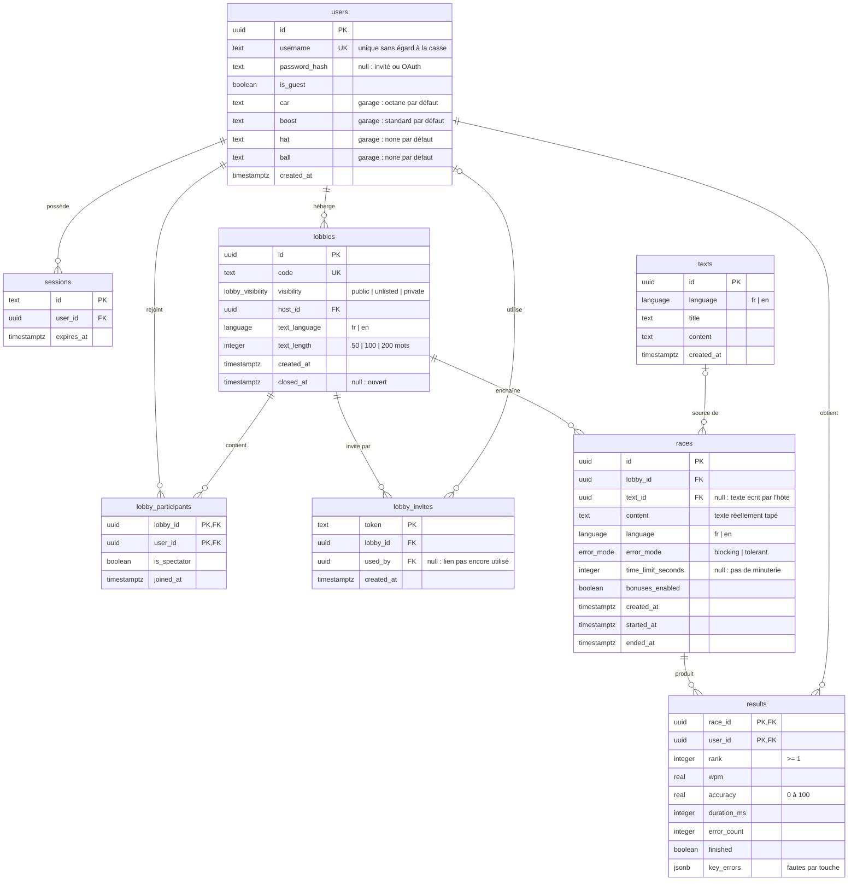
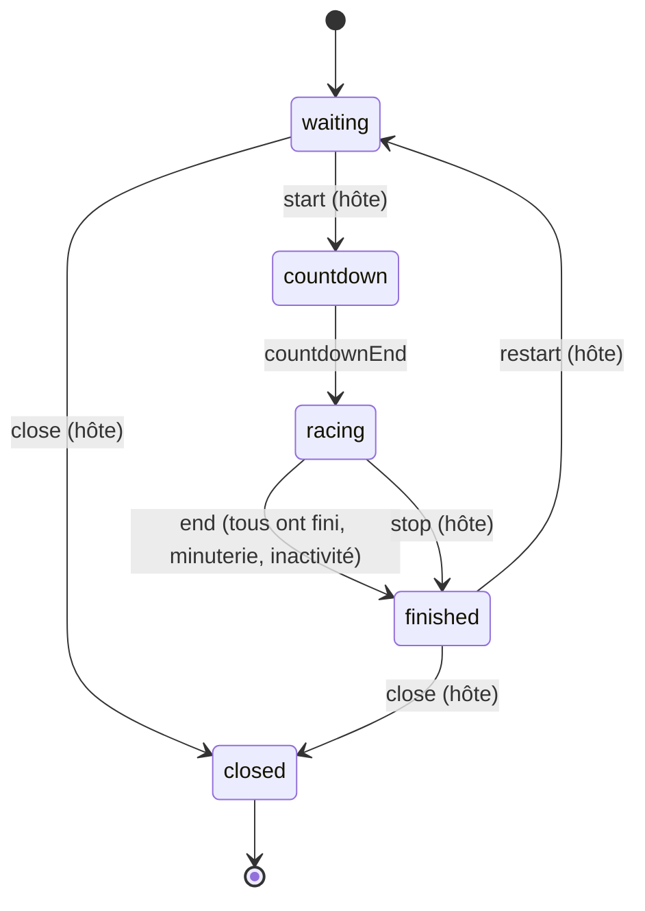
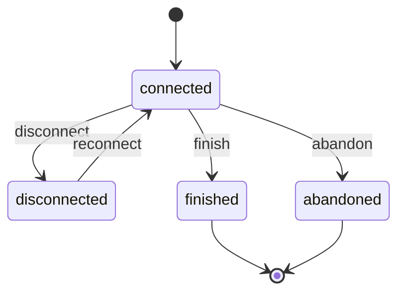
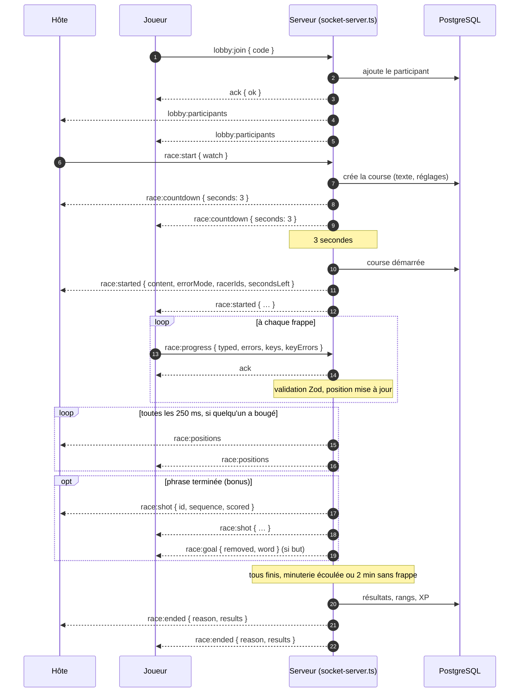

# Architecture

Modèle de données, machines à états, temps réel et bots.

## Modèle de données

Schéma PostgreSQL défini avec Drizzle dans [`db/schema.ts`](../db/schema.ts).

### Choix

- **Invités** : un invité est un `users` avec `is_guest = true`. Ses résultats sont liés à son compte, ce qui permet de les garder s'il s'inscrit (AUTH-7).
- **Lobby et course** : un lobby persiste entre plusieurs courses (LOB-9). Les paramètres choisis par l'hôte sont copiés dans chaque `races`, car ils peuvent changer d'une course à l'autre.
- **Texte d'une course** : `races.content` garde le texte exact qui a été tapé (coupé à la longueur choisie ou écrit par l'hôte). `text_id` pointe vers la banque de textes quand il y a lieu ; supprimer un texte de la banque ne touche pas l'historique.
- **Banque de textes** : la migration `0003_banque_de_textes` remplit `texts` avec des textes originaux pour les 12-16 ans (TXT-3). Le lobby garde la langue et la longueur choisies à sa création (`text_language`, `text_length`) ; au départ d'une course, un texte de cette langue est tiré au hasard et coupé à la fin de la phrase qui atteint le nombre de mots.
- **Garage** : `car`, `boost`, `hat` et `ball` sont du texte ; les valeurs permises sont dans `lib/garage-items.ts`, donc ajouter un objet ne demande pas de migration. Une valeur inconnue revient au choix par défaut. Seuls les inscrits enregistrent leur garage.
- **Participants** : `lobby_participants` liste les membres d'un lobby. `joined_at` sert à passer le rôle d'hôte au plus ancien participant.
- **Invitations** : une course privée se rejoint seulement par un lien `lobby_invites` (LOB-3). Le premier qui ouvre le lien le réserve (`used_by`) ; il peut le rouvrir, mais personne d'autre. Les liens ne marchent plus une fois le lobby fermé.
- **Bots** : ils ne sont pas enregistrés. Ils occupent une place dans le classement, donc `results.rank` reste exact, mais seuls les humains ont une ligne dans `results`.
- **Temps réel** : l'état d'une course en cours (positions, frappes) vit en mémoire sur le serveur. La base reçoit les résultats à la fin de la course.
- **Suppressions** : supprimer un lobby supprime ses participants, ses courses et leurs résultats. On ne peut pas supprimer un utilisateur qui est hôte d'un lobby.

## Machines à états

Définies en TypeScript dans [`lib/lobby-state.ts`](../lib/lobby-state.ts) et [`lib/player-state.ts`](../lib/player-state.ts). Un événement non permis dans l'état courant lance une erreur.

Les règles « seul l'hôte » et « au moins 2 participants » (LOB-6) sont vérifiées par le serveur avant d'envoyer l'événement.

### Course (lobby) — COURSE-01

| État        | Sens                                                  |
| ----------- | ----------------------------------------------------- |
| `waiting`   | Salle d'attente ; l'hôte règle les paramètres (LOB-9) |
| `countdown` | Compte à rebours avant le départ (CRS-1)              |
| `racing`    | Course en cours                                       |
| `finished`  | Résultats affichés                                    |
| `closed`    | Lobby fermé par l'hôte (LOB-10)                       |

- Le compte à rebours ne peut pas être annulé.
- On ne ferme le lobby qu'en attente ou après une course. Pendant une course, l'hôte peut seulement l'arrêter (`stop`).
- La course se termine (`end`) quand tous ont fini, quand la minuterie est écoulée ou après 2 min sans aucune frappe (CRS-5).

### Joueur (pendant une course)

| État           | Sens                                                     |
| -------------- | -------------------------------------------------------- |
| `connected`    | Tape le texte                                            |
| `disconnected` | Connexion perdue ; la course continue sans lui (CRS-6)   |
| `finished`     | A terminé le texte                                       |
| `abandoned`    | A cliqué sur « Abandonner » ; devient spectateur (CRS-7) |

- Pas de délai d'abandon : le joueur peut revenir tant que la course dure et reprend exactement où il était. S'il est encore absent à la fin, il est « non terminé ».
- `finished` et `abandoned` sont finaux pour la course. Une déconnexion après coup ne change plus l'état du joueur.

## Temps réel

Socket.IO auto-hébergé, sur le même serveur HTTP et le même port que Next.js ([`server.ts`](../server.ts)). Le choix et les options écartées sont dans l'[ADR 0001](adr/0001-realtime.md).

- Le serveur fait autorité : l'état d'une course en cours vit en mémoire dans [`lib/socket-server.ts`](../lib/socket-server.ts).
- Chaque lobby est une *room* Socket.IO. Les arrivées et départs mettent à jour la liste des participants chez tous.
- Pendant la course, chaque client envoie sa saisie ; le serveur la valide (Zod), calcule les positions et les diffuse à tous, au plus toutes les 250 ms et seulement si quelqu'un a bougé.
- La base reçoit les résultats à la fin de la course seulement.

### Flux des messages

La connexion Socket.IO porte le cookie de session : sans session valide, le serveur la refuse (`notLoggedIn`). Chaque message envoyé par le client reçoit un accusé (`ack`) `{ ok: true }` ou `{ ok: false, error }`.

| Message                             | Sens                      | Rôle                                                                                                   |
| ----------------------------------- | ------------------------- | ------------------------------------------------------------------------------------------------------ |
| `lobby:join`                        | client → serveur          | Entrer dans un lobby par son code. Refus possibles : introuvable, plein, course en cours, autre lobby. |
| `lobby:participants`                | serveur → lobby           | Liste à jour des participants (joueurs et bots) après chaque arrivée ou départ.                        |
| `lobby:addBot` / `lobby:removeBot`  | hôte → serveur            | Ajouter ou retirer un bot dans la salle d'attente.                                                     |
| `lobby:left`                        | serveur → onglet          | La personne a rejoint un autre lobby : ses autres onglets sortent de celui-ci.                         |
| `race:start`                        | hôte → serveur            | Lancer la course ; `watch` pour regarder sans courir.                                                  |
| `race:countdown`                    | serveur → lobby           | Début du compte à rebours (3 s).                                                                       |
| `race:started`                      | serveur → lobby           | Texte, mode d'erreur et coureurs. Un coureur qui revient reçoit aussi sa saisie (`mine`).              |
| `race:progress`                     | coureur → serveur         | Saisie complète du coureur ; le serveur en déduit la position.                                         |
| `race:positions`                    | serveur → lobby           | Classement en direct, au plus toutes les 250 ms.                                                       |
| `race:shot` / `race:goal`           | serveur → lobby / coureur | Tir à la fin d'une phrase ; en cas de but, le mot retiré du texte de ce coureur.                       |
| `race:giveUp`                       | coureur → serveur         | Abandonner ; la course continue sans lui.                                                              |
| `race:ended`                        | serveur → lobby           | Raison de la fin et résultats.                                                                         |
| `lobby:restart` / `lobby:restarted` | hôte → serveur → lobby    | Revenir aux réglages pour une nouvelle course.                                                         |
| `lobby:close` / `lobby:closed`      | hôte → serveur → lobby    | Fermer le lobby ; tout le monde est renvoyé à la liste.                                                |

**Reconnexion** : un coureur qui recharge la page renvoie `lobby:join`. Le serveur le remet dans la course et lui renvoie `race:started` avec sa saisie, puis `race:positions`. Après la fin, il reçoit directement `race:ended`.

## Bots

Le choix d'un moteur côté serveur et les options écartées sont dans l'[ADR 0002](adr/0002-bots.md).

### Aujourd'hui ([#76](https://github.com/Madlodon/taype-in/issues/76))

Moteur dans [`lib/bots.ts`](../lib/bots.ts), lancé par le serveur de sockets.

- L'hôte ajoute ou retire des bots dans la salle d'attente. Ils restent d'une course à l'autre.
- Un bot est un participant sans compte : il prend une place au classement, mais n'a pas de ligne dans `results`.
- Le serveur garde une minuterie par bot. À chaque touche, `botKey` donne le délai avant la prochaine touche et la saisie qui en résulte.
- La saisie passe par `applyInput`, comme pour un joueur : le bot respecte le mode d'erreur (en mode bloquant, il doit retaper le bon caractère).
- La fonction de hasard est passée en paramètre, ce qui permet des tests unitaires déterministes.

### Prévu pour la remise finale ([#132](https://github.com/Madlodon/taype-in/issues/132))

Cinq niveaux, avec les valeurs de l'énoncé (BOT-01) :

| Niveau        | MPM visé | Taux d'erreur |
| ------------- | -------- | ------------- |
| Noob          | 10–20    | ~12 %         |
| Débutant      | 20–35    | ~8 %          |
| Intermédiaire | 35–60    | ~5 %          |
| Expert        | 70–100   | ~2 %          |
| Impossible    | 140+     | ~0,5 %        |

- **Vitesse variable** (BOT-02) : chaque bot tire sa vitesse dans la plage de son niveau. Pendant la course, il alterne des séries plus rapides et des hésitations, et ralentit sur les mots difficiles (longs, avec accents, majuscules ou ponctuation).
- **Erreurs** (BOT-03) : une faute coûte un temps de correction. En mode bloquant, le bot retape le bon caractère ; en mode tolérant, il continue avec la faute.
- **Identifiés** (BOT-04) : badge « BOT » dans la salle, sur la piste et dans les résultats. Leur progression passe par le même chemin que celle des joueurs, donc les bonus et malus les touchent aussi.
- **Déterministe** (BOT-05) : chaque bot reçoit une graine (seed) tirée de la course et de son numéro. Un générateur pseudo-aléatoire à graine remplace `Math.random`, donc la même graine donne toujours la même course dans les tests.
