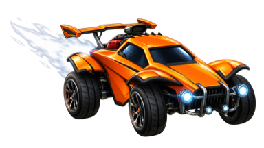
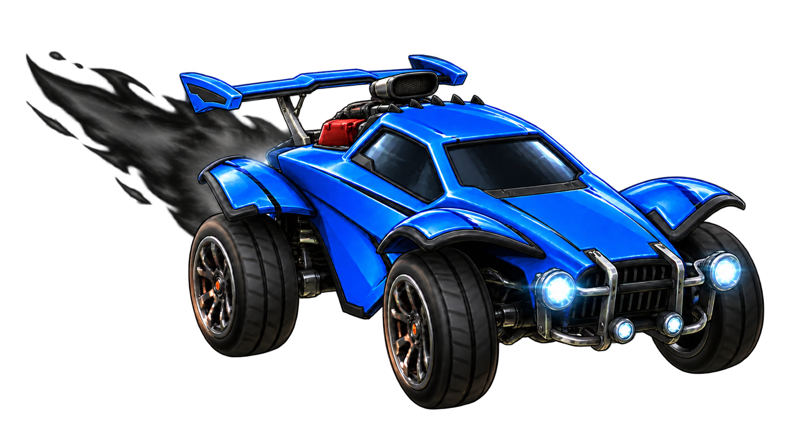
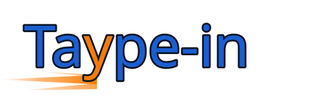
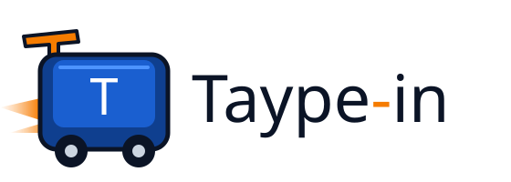
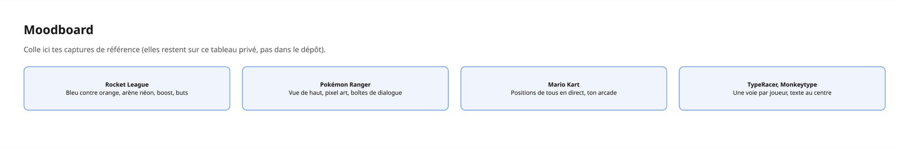
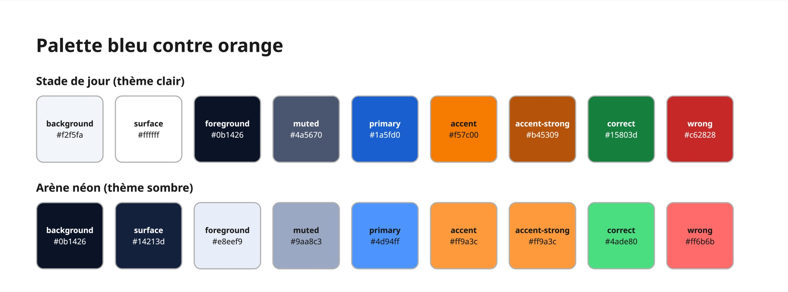
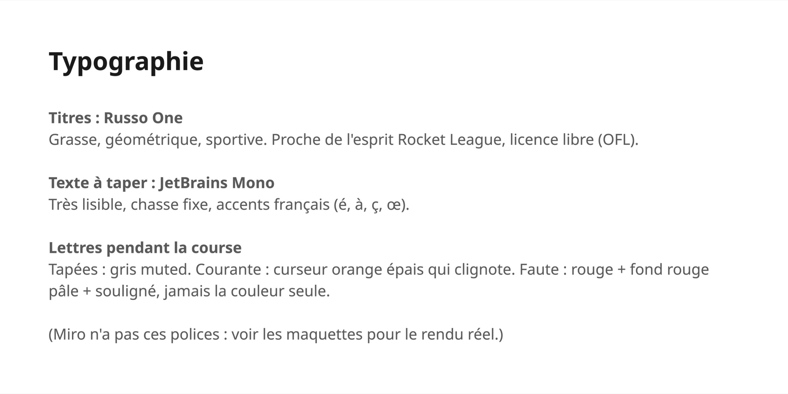
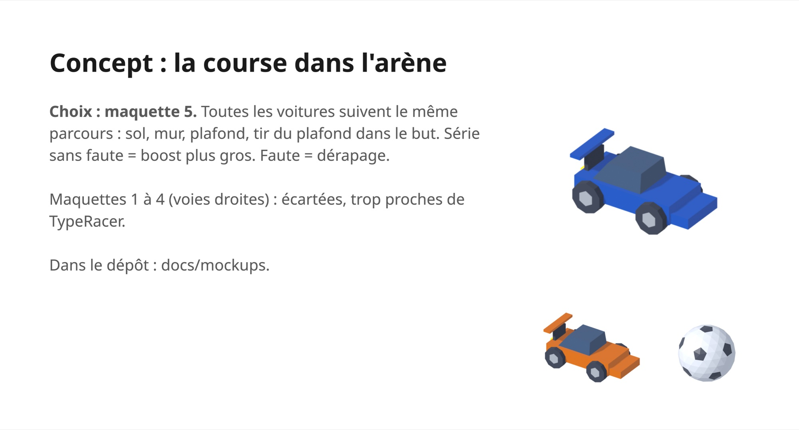

# Direction artistique

Exigence UI-4 : direction artistique marquée et originale, avec des mécaniques qui jouent avec le visuel.

## Thème

**Soccer de voitures, ambiance arcade**, inspiré de Rocket League : arène, bleu contre orange, traînées de boost, explosions de but.

### Concept : la course dans l'arène

Toutes les voitures suivent **le même parcours sinueux dans une arène**, vue en coupe comme une maison de poupée ([maquette 5](mockups/5-arena-run.html)) :
coup d'envoi au centre, sol, montée du mur, plafond, puis **tir du plafond** dans le but. Chaque joueur pousse son propre ballon ; le but marqué = texte terminé.

- **Taper fait avancer** la voiture sur le parcours.
- **Série sans faute** : la traînée de boost grossit (boost, gros boost, supersonique).
- **Faute** : la voiture dérape et le boost retombe à zéro.
- On sent sa précision dans l'arène sans quitter le texte des yeux (CRS-3, CRS-8).

La course reste individuelle, chacun pour soi (CRS-2, FIN-1, Q-7).

Pour plus tard :

- Mode par équipes, deux équipes au hasard et un ballon commun ([#33](https://github.com/Madlodon/taype-in/issues/33)).
- Garage : page `/garage` pour choisir la voiture (Octane, Fennec, Dominus, Merc), le boost, le chapeau et le ballon, purement esthétique ; Fennec, Dominus et Merc sont encore des silhouettes ([#34](https://github.com/Madlodon/taype-in/issues/34)).
- Récompenses : chapeaux et styles de boost débloqués par niveau ([#35](https://github.com/Madlodon/taype-in/issues/35)).
- Autres caméras à essayer : vue du dessus avec les murs dépliés, ou caméra qui suit ta voiture avec une mini-carte.

### Interface de l’application

Toutes les pages partagent la navigation, les surfaces, les accents bleu/orange et les illustrations du stade. Les formulaires et les salles gardent les mêmes repères en français et en anglais, sur mobile comme sur ordinateur.

La route `/race` propose un **aperçu jouable en solo** : texte localisé, voiture et ballon sur le parcours, progression, précision, vitesse et but final. Les erreurs doivent être corrigées pour avancer. Le bouton Recommencer remet la course à zéro.

Cet aperçu ne sauvegarde aucun résultat et n’est pas connecté aux salles multijoueurs. Les salles affichent les participants en direct et expliquent cette limite. Le boost selon les séries, les adversaires et les effets de but restent à implémenter dans la course multijoueur.

### Rocket League

- **Obligatoire** : l'avis « Projet de fan inspiré de Rocket League. Non affilié à Epic Games ni à Psyonix, ni approuvé par eux. » dans le pied de page de chaque page (FR/EN) et dans le README.

## Palette

Bleu = couleur principale (boutons, ta voiture). Orange = accent (boost, curseur, rivaux). Vert et rouge servent uniquement aux lettres justes et fausses.
Deux ambiances : **stade de jour** (thème clair) et **arène néon de nuit** (thème sombre).

Les jetons sont dans [`app/globals.css`](../app/globals.css) et s'utilisent avec Tailwind (`bg-primary`, `text-muted`, `border-border`…).

| Jeton                | Clair     | Sombre    | Rôle                                        |
| -------------------- | --------- | --------- | ------------------------------------------- |
| `background`         | `#f2f5fa` | `#0b1426` | Fond de page                                |
| `foreground`         | `#0b1426` | `#e8eef9` | Texte principal                             |
| `surface`            | `#ffffff` | `#14213d` | Cartes, zone du texte à taper               |
| `muted`              | `#4a5670` | `#9aa8c3` | Texte secondaire, lettres déjà tapées       |
| `border`             | `#76839b` | `#6b7a99` | Bordures des champs et des cartes           |
| `primary`            | `#1a5fd0` | `#4d94ff` | Boutons, ta voiture                         |
| `primary-foreground` | `#ffffff` | `#0b1426` | Texte sur `primary`                         |
| `accent`             | `#f57c00` | `#ff9a3c` | Fond orange (boost, badges)                 |
| `accent-foreground`  | `#0b1426` | `#0b1426` | Texte sur `accent`                          |
| `accent-strong`      | `#b45309` | `#ff9a3c` | Orange lisible sur le fond : curseur, texte |
| `correct`            | `#15803d` | `#4ade80` | Lettre juste, dépassement                   |
| `wrong`              | `#c62828` | `#ff6b6b` | Lettre fausse, se faire dépasser            |
| `wrong-surface`      | `#fde2e2` | `#4a1620` | Fond de la lettre fausse                    |

Bleu et orange restent distinguables pour les daltonismes les plus courants (rouge-vert).

### Contrastes (WCAG 2.2 AA)

Texte : 4,5:1 minimum. Composants et éléments graphiques (bordures, curseur) : 3:1.
Vérifiés automatiquement par [`__tests__/palette.test.ts`](../__tests__/palette.test.ts).

| Paire                               | Clair | Sombre |
| ----------------------------------- | ----- | ------ |
| `foreground` sur `background`       | 16,8  | 15,8   |
| `foreground` sur `surface`          | 18,4  | 13,7   |
| `muted` sur `background`            | 6,7   | 7,7    |
| `muted` sur `surface`               | 7,4   | 6,7    |
| `primary-foreground` sur `primary`  | 5,8   | 6,1    |
| `accent-foreground` sur `accent`    | 6,8   | 8,7    |
| `accent-strong` sur `background`    | 4,6   | 8,7    |
| `correct` sur `background`          | 4,6   | 10,6   |
| `wrong` sur `background`            | 5,1   | 6,6    |
| `wrong` sur `wrong-surface`         | 4,6   | 5,3    |
| `foreground` sur `wrong-surface`    | 15,0  | 12,6   |
| `primary` sur `background` (3:1)    | 5,4   | 6,1    |
| `border` sur `background` (3:1)     | 3,5   | 4,3    |
| `border` sur `surface` (3:1)        | 3,8   | 3,7    |

L'orange vif `accent` (2,5:1 sur le fond clair) ne sert jamais seul pour du texte ou le curseur : on prend `accent-strong`.

## Typographie

Chargées avec `next/font` (aucune dépendance), licence OFL.

| Usage                  | Police                                                               | Jeton          | Pourquoi                                                   |
| ---------------------- | -------------------------------------------------------------------- | -------------- | ---------------------------------------------------------- |
| Titres (`h1`, `h2`)    | [Russo One](https://fonts.google.com/specimen/Russo+One)             | `font-display` | Grasse, géométrique, sportive : proche de l'esprit RL      |
| Texte à taper, codes   | [JetBrains Mono](https://fonts.google.com/specimen/JetBrains+Mono)   | `font-mono`    | Très lisible, accents français (é, à, ç, œ), chasse fixe   |
| Texte courant          | Arial / Helvetica (inchangé, `body` dans `globals.css`)              | —              | Neutre, laisse la place aux titres                         |

## Texte pendant la course

- **Lettres tapées** : couleur `muted`.
- **Lettre courante** : curseur épais `accent-strong` à gauche, qui clignote.
- **Faute** : couleur `wrong` **et** fond `wrong-surface` **et** soulignement ondulé. Jamais la couleur seule.
- **Dépassement** (CRS-3) : court message juste au-dessus du texte, `correct` (▲) ou `wrong` (▼), pour le voir sans quitter le texte des yeux.

## Animations

- **Grosses animations hors course** : lobby, compte à rebours (moteurs, ballon lâché), podium (explosion de but, confettis).
- **Pendant la course** (CRS-8) : seulement la piste (voitures, ballons, traînée de boost) et le message de dépassement. Rien derrière le texte.
- **Plus tard, bonus** : vraie 3D (three.js) pour le podium uniquement. Pendant la course : sprites 2.5D, sans moteur 3D, pour rester léger sur Chromebook et mobile.

## Maquettes

Écrans de course statiques, avec de fausses données : 4 joueurs, dont toi en bleu.
On peut **taper pour vrai** : ta voiture avance et les bots roulent seuls ([`demo.js`](mockups/demo.js)).
Pour les ouvrir : `python3 -m http.server 8123 -d docs/mockups`, puis http://localhost:8123.

| Maquette                                         | Style                                           | Texte                   | Caméra            |
| ------------------------------------------------ | ----------------------------------------------- | ----------------------- | ----------------- |
| [1 · Arène néon 2D](mockups/1-neon-2d.html)      | Lignes lumineuses, bouton jour/nuit             | Une ligne qui défile    | De côté           |
| [2 · Cartoon arcade](mockups/2-cartoon.html)     | Contours épais, couleurs saturées, rebonds      | Bloc de 3–4 lignes      | De côté, grande   |
| [3 · 2.5D Blender](mockups/3-sprites-2-5d.html)  | Sprites de modèles low-poly, terrain incliné    | Une ligne qui défile    | 3/4, en diagonale |
| [4 · Pixel art](mockups/4-pixel-top-down.html)   | Pixel art façon Pokémon Ranger, boîte de dialogue | Bloc de 3–4 lignes    | Vue de haut       |
| [5 · Course dans l'arène](mockups/5-arena-run.html) | Arène néon, parcours sol → mur → plafond → but | Bouton : ligne ou bloc | En coupe          |

**Choix : la maquette 5.** Les maquettes 1 à 4 restent comme exploration : leurs voies droites l'une sous l'autre ressemblaient trop à TypeRacer, peu importe le style.
La mise en page du texte (une ligne ou un bloc) se décidera dans l'issue de l'écran de course.

### Études d'arène plus réaliste

La [maquette 6](mockups/6-arena-studies.html) compare trois pistes : stade en coupe,
diorama 3D et [SVG vu du dessus](mockups/assets/arena-top-view.svg). Elles ajoutent
des murs courbes, des buts en retrait, des gradins et des marques sur le gazon.
**Direction retenue : le diorama 3D**, sans les cinq traits colorés dans chaque
coin avant. Les gradins restent proches des buts sans les traverser ; le dégagement
supplémentaire est sur les côtés. Des semelles en béton, des poteaux et des
contreventements en acier soutiennent les gradins. L'arène de l'application reste
inchangée pendant cette étude.
La vue du dessus nécessiterait une adaptation pour montrer le parcours mur/plafond.

Le [modèle Blender](mockups/assets/arena.blend) et les deux rendus se régénèrent avec :

```bash
/Applications/Blender.app/Contents/MacOS/Blender -b -t 8 -P docs/mockups/assets/arena-model.py
```

### Modèles Blender

[`mockups/assets/models.py`](mockups/assets/models.py) construit une voiture et un ballon low-poly, puis les rend en sprites PNG transparents (voiture bleue, voiture orange, ballon). Les fichiers `.blend` peuvent être retouchés à la main dans Blender.

```bash
/Applications/Blender.app/Contents/MacOS/Blender -b -P docs/mockups/assets/models.py
```

## Logo

**Logo final : une Octane illustrée avec une traînée de boost.** La couleur suit le thème du site : voiture orange et boost blanc en sombre, voiture bleue et boost noir en clair.
Les deux images sont générées par IA (fond transparent), à partir d'une image de référence de l'Octane.

| Thème sombre                                | Thème clair                                   |
| ------------------------------------------- | --------------------------------------------- |
|    |      |

Le favicon ([`app/icon.svg`](../app/icon.svg)) reprend la même Octane, recadrée sur la voiture. Il suit le thème du navigateur, car le thème choisi sur le site ne lui est pas accessible.

Les deux pistes de départ, écartées :

| Concept b : boost sur le « y »                     | Concept c : touche-voiture                               |
| -------------------------------------------------- | -------------------------------------------------------- |
|              |               |

## Moodboard

Liens seulement : les images de ces sources sont protégées par le droit d'auteur et ne sont pas copiées dans le dépôt.
Les captures de référence vont sur le [tableau Miro](https://miro.com/app/board/uXjVHgaNzVI=/) (privé), avec la palette, les logos et les sprites.

Export du tableau Miro (seulement nos propres images) :






| Référence                                                                    | Ce qu'on en retient                                                  |
| ---------------------------------------------------------------------------- | -------------------------------------------------------------------- |
| [Rocket League](https://www.rocketleague.com)                                | Bleu contre orange, arène néon, boost, explosions de but, ballon     |
| [Pokémon Ranger](https://en.wikipedia.org/wiki/Pok%C3%A9mon_Ranger)          | Vue de haut, pixel art, boîtes de dialogue (maquette 4)              |
| [Mario Kart](https://en.wikipedia.org/wiki/Mario_Kart)                       | Positions de tous visibles en direct (CRS-2), ton arcade et familial |
| [TypeRacer](https://play.typeracer.com)                                      | Une voie par joueur au-dessus du texte                               |
| [Monkeytype](https://monkeytype.com)                                         | Texte au centre, rien qui distrait (CRS-8), états des lettres        |
| [Russo One](https://fonts.google.com/specimen/Russo+One)                     | Titres                                                               |
| [JetBrains Mono](https://www.jetbrains.com/lp/mono/)                         | Texte à taper                                                        |
