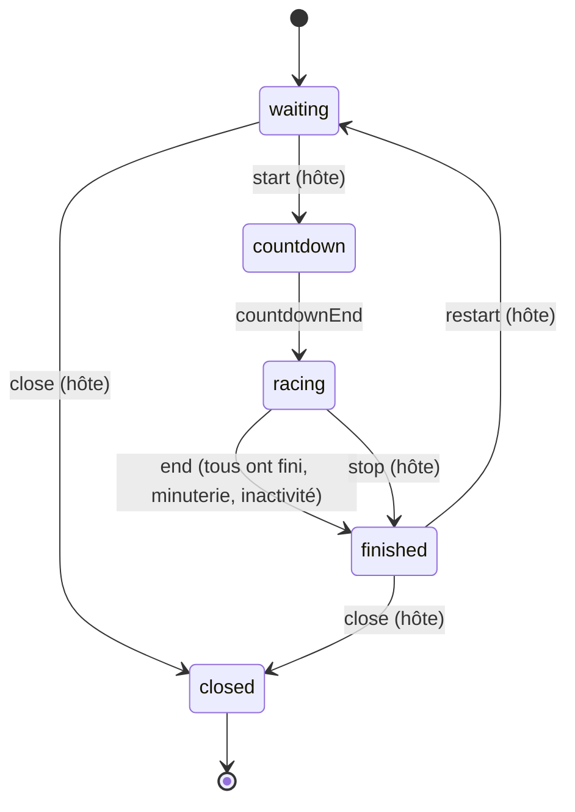
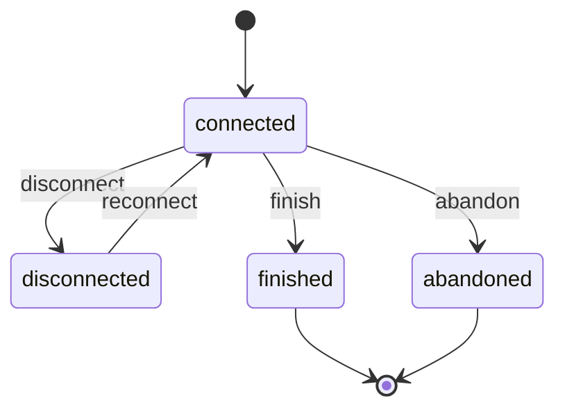

# Machines à états

Définies en TypeScript dans [`lib/lobby-state.ts`](../lib/lobby-state.ts) et [`lib/player-state.ts`](../lib/player-state.ts). Un événement non permis dans l'état courant lance une erreur.

Les règles « seul l'hôte » et « au moins 2 participants » (LOB-6) sont vérifiées par le serveur avant d'envoyer l'événement.

## Lobby

| État        | Sens                                                  |
| ----------- | ----------------------------------------------------- |
| `waiting`   | Salle d'attente ; l'hôte règle les paramètres (LOB-9) |
| `countdown` | Compte à rebours avant le départ (CRS-1)              |
| `racing`    | Course en cours                                       |
| `finished`  | Résultats affichés                                    |
| `closed`    | Lobby fermé par l'hôte (LOB-10)                       |

- Le compte à rebours ne peut pas être annulé.
- On ne ferme le lobby qu'en attente ou après une course. Pendant une course, l'hôte peut seulement l'arrêter (`stop`).
- La course se termine (`end`) quand tous ont fini, quand la minuterie est écoulée ou après 2 min sans aucune frappe (CRS-5).

## Joueur (pendant une course)

| État           | Sens                                                     |
| -------------- | -------------------------------------------------------- |
| `connected`    | Tape le texte                                            |
| `disconnected` | Connexion perdue ; la course continue sans lui (CRS-6)   |
| `finished`     | A terminé le texte                                       |
| `abandoned`    | A cliqué sur « Abandonner » ; devient spectateur (CRS-7) |

- Pas de délai d'abandon : le joueur peut revenir tant que la course dure et reprend exactement où il était. S'il est encore absent à la fin, il est « non terminé ».
- `finished` et `abandoned` sont finaux pour la course. Une déconnexion après coup ne change plus l'état du joueur.
