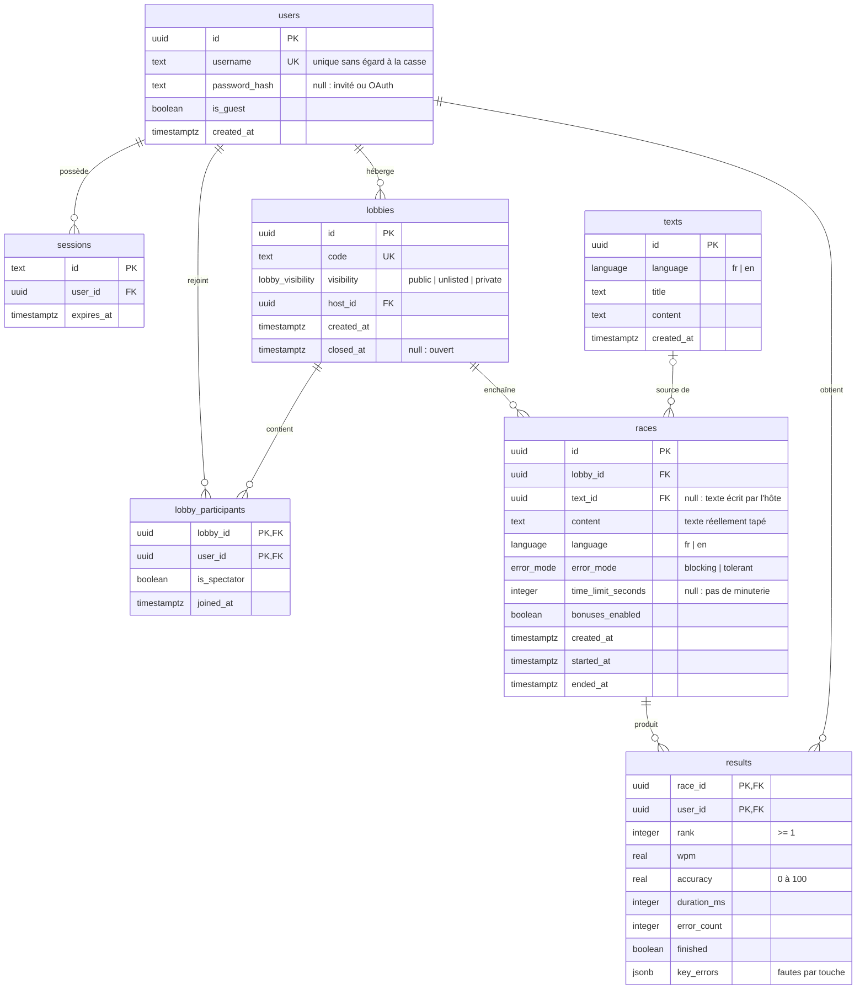

# Modèle de données

Schéma PostgreSQL défini avec Drizzle dans [`db/schema.ts`](../db/schema.ts).

## Choix

- **Invités** : un invité est un `users` avec `is_guest = true`. Ses résultats sont liés à son compte, ce qui permet de les garder s'il s'inscrit (AUTH-7).
- **Lobby et course** : un lobby persiste entre plusieurs courses (LOB-9). Les paramètres choisis par l'hôte sont copiés dans chaque `races`, car ils peuvent changer d'une course à l'autre.
- **Texte d'une course** : `races.content` garde le texte exact qui a été tapé (coupé à la longueur choisie ou écrit par l'hôte). `text_id` pointe vers la banque de textes quand il y a lieu ; supprimer un texte de la banque ne touche pas l'historique.
- **Participants** : `lobby_participants` liste les membres d'un lobby. `joined_at` sert à passer le rôle d'hôte au plus ancien participant.
- **Bots** : ils ne sont pas enregistrés. Ils occupent une place dans le classement, donc `results.rank` reste exact, mais seuls les humains ont une ligne dans `results`.
- **Temps réel** : l'état d'une course en cours (positions, frappes) vit en mémoire sur le serveur. La base reçoit les résultats à la fin de la course.
- **Suppressions** : supprimer un lobby supprime ses participants, ses courses et leurs résultats. On ne peut pas supprimer un utilisateur qui est hôte d'un lobby.
